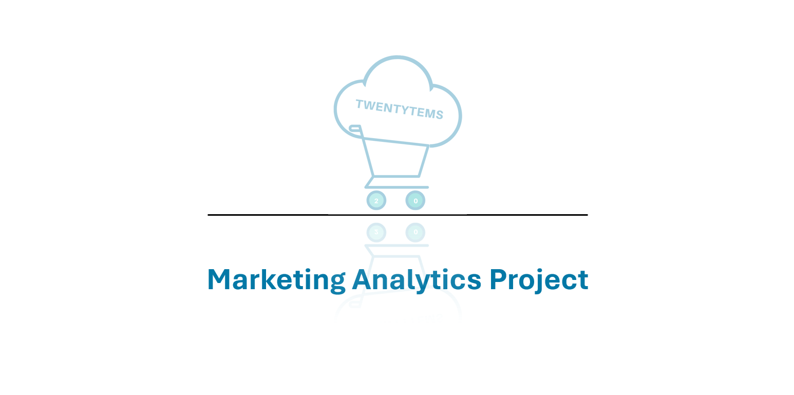

# Project: Analysis and Improvement of Twentytems' Online Sales Performance

This workflow outlines the process of data cleaning and preparation, followed by analysis and visualization, aimed at improving the performance of the online shop Twentytems. The project primarily involves working with SQL, Python, and Power BI.

## Overview:

### Data Source:

- Customer Journey Data: Website visits and purchase information collected by the online shop.  
- Customer Reviews Data: Feedback collected from various platforms by the online shop.    
- Engagement data: Metrics related to customer interactions with marketing content, including clicks and likes collected by the online shop.  

### Project Steps:  

**1. Data Acquisition:**  
  - Data is collected from various sources on the online shop's website, including customer reviews or marketing tools such as Google Analytics (engagement rate). 
  - Source data can be found in the source_data folder:
      - File Path: assets/source_data  
    
**2. Data Exploration with Excel:**  
  - Analyze the dataset (from all sources) to understand its structure and quality.  

**3. SQL Data Cleaning and Preparation:**  
  - Import the CSV files into Microsoft SQL Server for cleaning, standardization, and preparation for future analysis.  
  - Use SELECT or VIEWS to simplify the source data in order to access key columns and metrics.  
  - SQL queries for data cleaning, standardization, and preparation are available at:  
    - File Path: assets/sql/queries  
  - Export the final cleaned data as CSV.  
  - Check the cleaned data files, available at:  
    - File Path: assets/sql/final_csv_exported_views  

**4. Data Enrichment with Python:**  
  - Analyze reviews to understand customer sentiment with NLTK Library  
  - Check the python code for the sentiment analysis:  
    - File Path: assets/jupyter_lab/sentiment_analysis/sentiment_analysis.ipynb  
  - Check the final dataset with sentiment analysis:  
    - File Path: assets/jupyter_lab/analyzed_data/customer_analyzed_reviews.csv  

**5. Data Visualization:**  
  - Create Power BI dashboards using the cleaned data to build visualizations that showcase key performance indicators.  
  - Use the cleaned data (from the SQL view and customer_analyzed_reviews.csv) to create an in-depth analysis dashboard in Power BI.  
  - Note:  
    - Images of the dashboards can be viewed at:
      File Path: assets/images/dashboards  
    - The original Power BI dashboard file can be downloaded from:
      File Path: dashboard/OnlineRetailBusinessCustomerAnalysisDashboard.pbix  

### Conclusion:  
The goal of this project is to identify key areas for improvement in Twentytems' marketing strategies through the analysis of conversion rates, engagement metrics, and customer feedback. The recommendations derived from the analysis will provide insights that can help improve overall performance and support the growth of the Twentytems online shop.  

---

# Projekt: Analýza a zlepšení výkonnosti online prodeje Twentytems  

Tento projekt popisuje proces čištění a přípravy dat, a následné analýzy a vizualizace dat, která by měla vést ke zlepšení výkonnosti online obchodu Twentytems. V projektu pracujeme především s SQL, Pythonem a Power BI.

## Přehled:

### Zdroj dat:

- Data o zákaznické cestě: návštěvy webových stránek a informace o nákupech shromážděné online obchodem.
- Data o zákaznických recenzích: zpětná vazba shromážděná z různých platforem online obchodem.
- Data o zapojení: metriky týkající se interakcí zákazníků s marketingovým obsahem, a to včetně kliknutí a lajků, shromážděné také online obchodem.

### Postup projektu:

**1. Sběr dat:**  

- Data jsou sesbírána z různých zdrojů na webu online shopu, včetně zákaznických recenzí, nebo marketingových nástrojů jako je google analytics (engagement rate).  
Zdrojová data najdete ve složce source_data: assets/source_data  

**2. Průzkum dat v Excelu:**  

Analyzujte dataset (ze všech zdrojů) k pochopení jeho struktury a kvality.  

**3. Čistění a příprava dat v SQL:**  

- Importujte CSV soubory do Microsoft SQL Serveru pro čištění, standardizaci a přípravu k budoucí analýze.  
- Pomocí SELECT, nebo VIEWS zjednodušte zdrojová data, abychom se dostali k důležitým sloupcům a metrikám.  
- SQL dotazy pro čištění, standardizaci a přípravu dat naleznete zde: assets/sql/queries  
- Exportujte finální vyčištěná data jako CSV.  
- Finální soubory můžete zkontrolovat v tomto adresáři: assets/sql/final_csv_exported_views  
    
**4. Úprava dat pomocí Pythonu - analýza sentimentu:**  

- Analyzujte zákanické recenze k pochopení sentimentu klientů pomocí knihovny NLTK.  
- Python kód pro analýzu sentimentu lze najít zde: assets/jupyter_lab/sentiment_analysis/sentiment_analysis.ipynb  
- Zkontrolujte finální dataset s analýzou sentimentu: assets/jupyter_lab/analyzed_data/customer_analyzed_reviews.csv
  
**5. Vizualizace dat:**  

- Pomocí Power BI vytvořte dashboardy, které ukazují klíčové ukazatele výkonnosti.  
- Použijte finální data (z SQL a souboru customer_analyzed_reviews.csv).  
**Poznámka:**
  - Obrázky dashboardů naleznete zde: assets/images/dashboards  
  - Lze také Stáhnout dashboardy z Power BI. Cesta k souboru: dashboard/OnlineRetailBusinessCustomerAnalysisDashboard.pbix  

**Závěr:**  
Cílem tohoto projektu je identifikovat klíčové oblasti pro zlepšení marketingových strategií společnosti Twentytems prostřednictvím analýzy konverzních poměrů, metrik zapojení a zpětné vazby od zákazníků. Doporučení vycházející z analýzy poskytne poznatky, které mohou pomoci zlepšit celkový výkon a podpořit růst podnikání online shopu Twentytems.  

